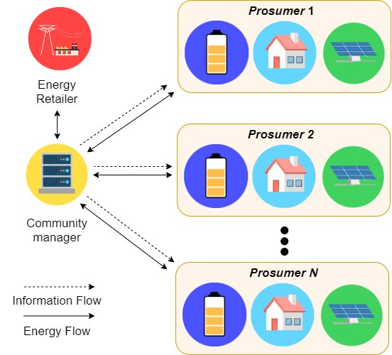
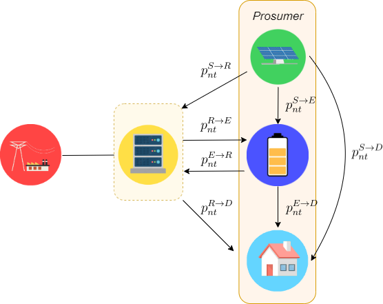

Scripts for a university project, a simple centralized/cooperative smart grid energy cost optimization problem.

Given the smart grid topology in the following figures

  <table style="{border: none;}"><tr>
    <td>  </td>
    <td>  </td>
  </tr></table>

# References

N. Vespermann, T. Hamacher and J. Kazempour, "Access Economy for Storage in Energy Communities," in _IEEE Transactions on Power Systems_, https://doi.org/10.1109/TPWRS.2020.3033999.

N. Vespermann, T. Hamacher, and J. Kazempour, "Electronic companion: Access economy for storage in energy communities", Technical
University of Munich, Tech. Rep., 2020. [Online], https://bitbucket.org/nivesp/marketdesign_energycommunities/.
