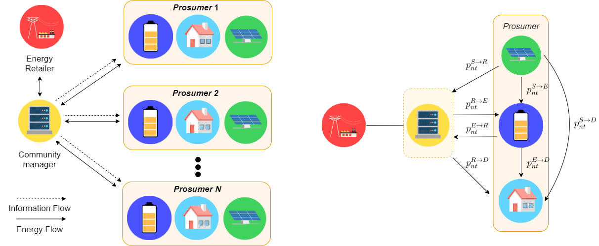

Scripts for a university project, a simple centralized/cooperative smart grid energy cost minimization problem.

## Brief formulation
The smart grid topology is depicted in the figure on the left, while on the right the single prosumer energy flow.

    

The tensor of variables is
 

  
 

 
 where  is the domestic _demand_,  is the _PV generator_,  is the _storage_ and the notation  stands for the energy dispatched from device  to device  at time  for prosumer . The _storage_ charge state is  for prosumer  at time .
 
The optimization problem is 

    

subject to

  
 

## References

N. Vespermann, T. Hamacher and J. Kazempour, "Access Economy for Storage in Energy Communities," in _IEEE Transactions on Power Systems_, https://doi.org/10.1109/TPWRS.2020.3033999.

N. Vespermann, T. Hamacher, and J. Kazempour, "Electronic companion: Access economy for storage in energy communities", Technical
University of Munich, Tech. Rep., 2020. [Online], https://bitbucket.org/nivesp/marketdesign_energycommunities/.

Paul Neetzow, Roman Mendelevitch, Sauleh Siddiqui, "Modeling coordination between renewables and grid: Policies to mitigate distribution grid constraints using residential PV-battery systems", _Energy Policy_, Volume 132, 2019, https://doi.org/10.1016/j.enpol.2019.06.024.
